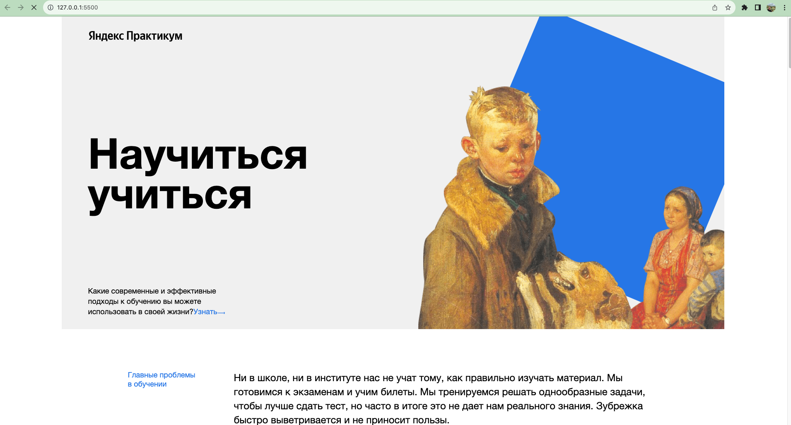
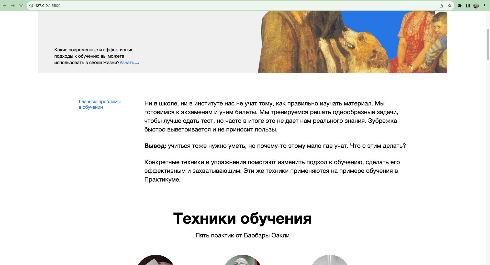
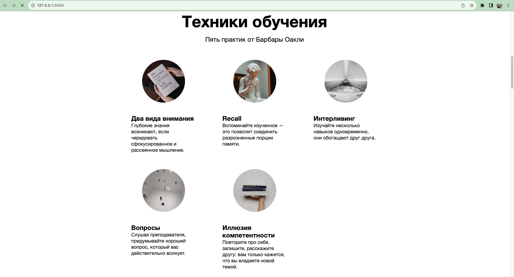
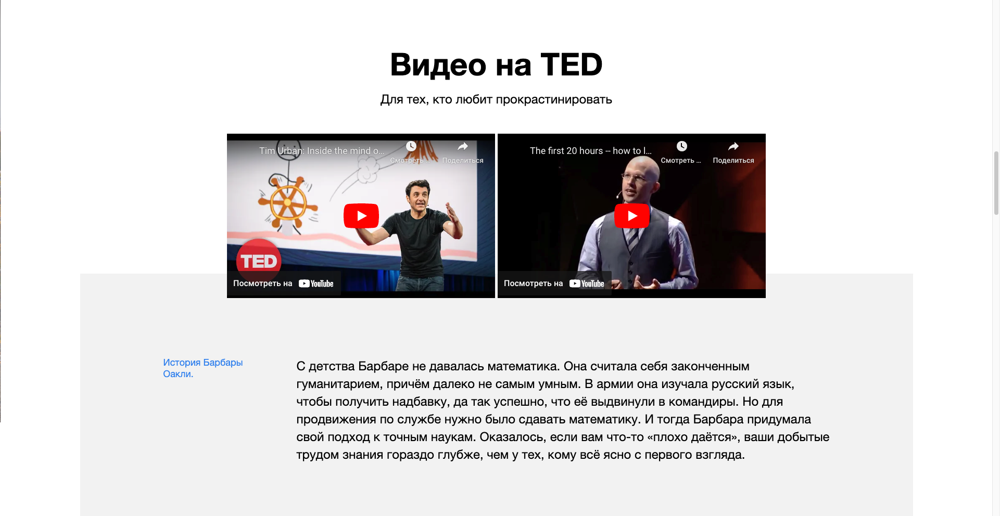
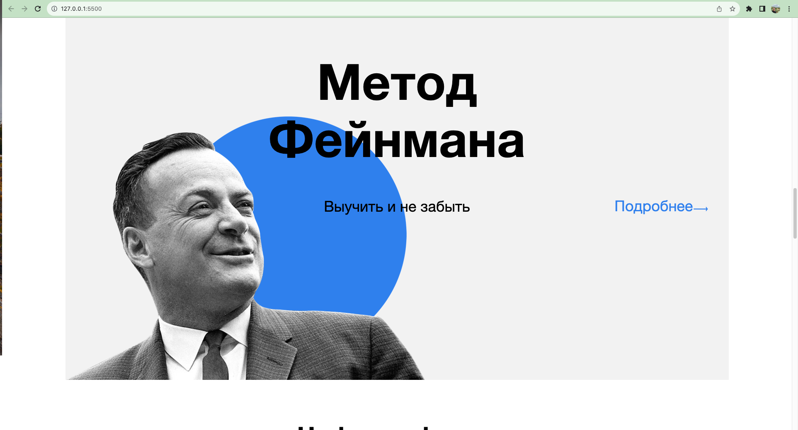
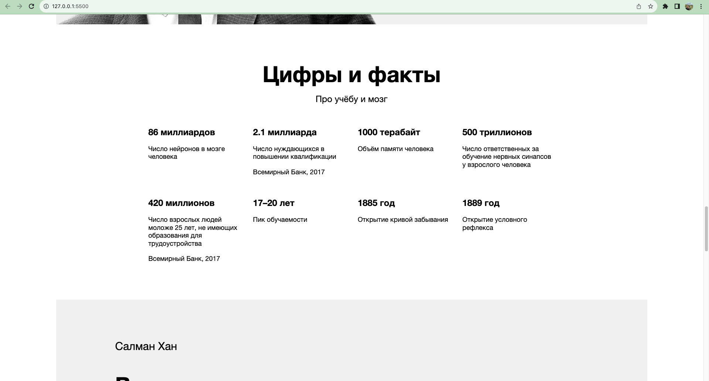
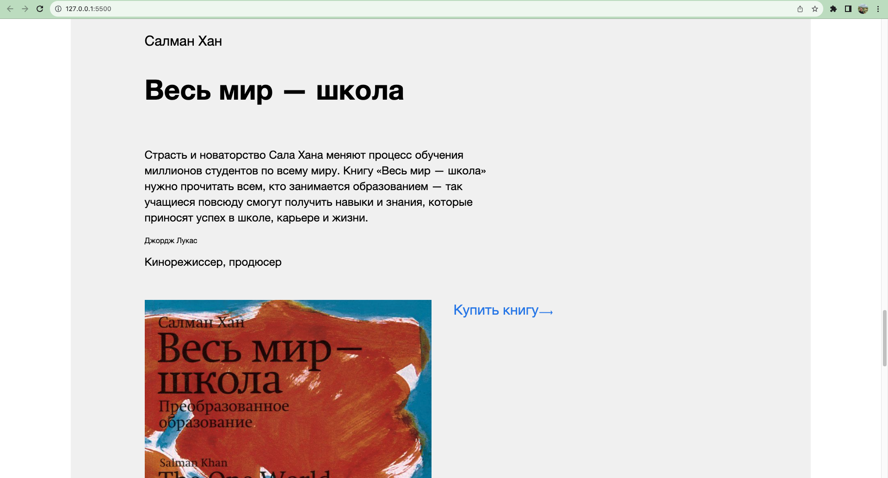
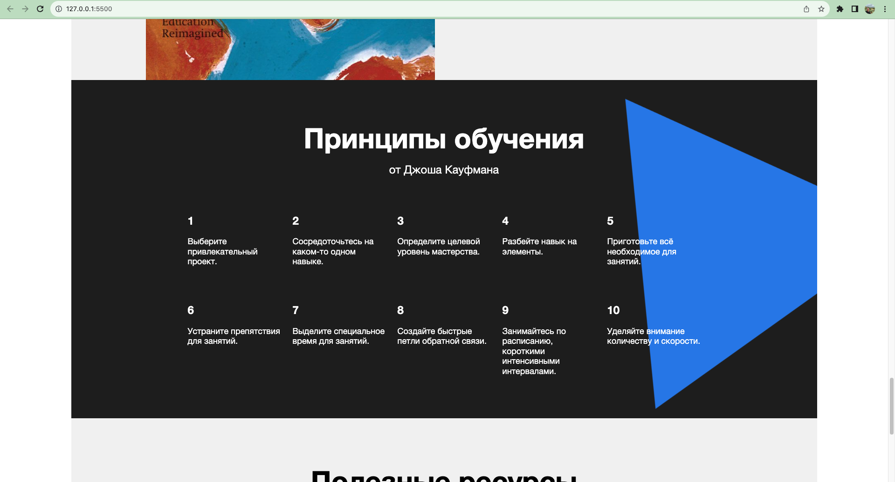
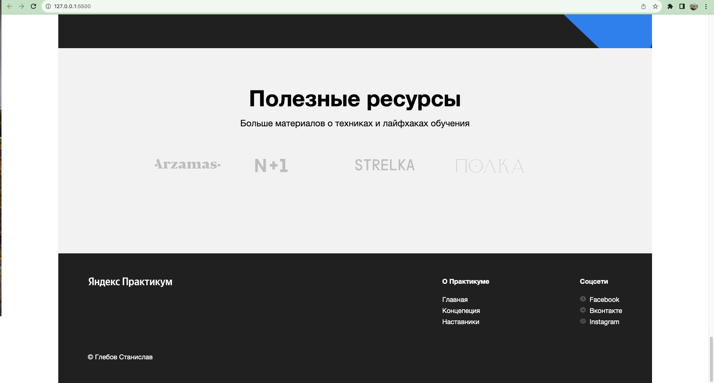

<h1 align="center">Проект: How-to-learn</h1>

Это один из стартовых проектов на обучении.
Сайт, рассказывающи о техниках обучения, проблемах, методах и фактах.
Здесь вы найдете полезные ссылки и видео, а также, литературу.
Сайт сделан полностью - Глебовым Станиславом.

<h2 align="center">Фото проекта</h2>

 

